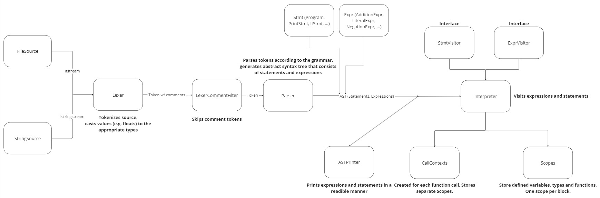

# boalang

`silne, stałe, wartość`

## Przygotowanie środowiska

### Windows + WSL / Linux (Ubuntu 22.04)
Wymagania: `CMake >= 3.22`, `kompilator zgodny ze standardem C++20 (rekomendowany Clang-14)`, `Python >= 3.6`,  `Clang-Tidy`

Opcjonalnie: `Clang-Format`, `Doxygen Graphviz`

1. Pobieranie zależności potrzebnych do kompliacji `CMake`, `Python`, `Clang`:
`sudo apt install cmake python3 python3.10-venv clang-14 clang-tidy`
2. Klonowanie repozytorium: `git clone https://gitlab-stud.elka.pw.edu.pl/TKOM_24L_WW/Maciej_Kozlowski/tkom-boalang.git`
3. Instalacja i konfiguracja `Conan 2`, pierwszy build:
   `chmod +x configure.sh build.sh && ./configure.sh` (skrypty jako argument pozycyjny mogą przyjąć Debug (domyślnie) lub Release)
4. Opcjonalnie:
   - formatowanie kodu `sudo apt install clang-format && cd build && make format` (w projekcie użyty jest styl Google)
   - generowanie dokumentacji `sudo apt install doxygen graphviz && cd build && make docs`
   - uruchamianie testów `cd build && make test`

`Clang-Tidy` uruchamiane jest automatycznie na plikach źródłowych w trakcie kompilacji.

## Sposób uruchamiania

### Windows + WSL / Linux (Ubuntu 22.04)
1. Kompilacja: `./build.sh`
2. Uruchamianie: `./build/src/boalang <ścieżka_do_pliku>` lub `./build/src/boalang --cmd "<kod>"`

## Statystyki

- liczba linii kodu: **6836** (`find . -type f \( -name "*.cpp" -o -name "*.hpp" -o -name "*.tpp" \) -print0 | xargs -0 wc -l`)
- procentowe pokrycie kodu testami: **91%** (mierzone przy użyciu `llvm-cov`)
- liczba testów: **242**

## Zasady działania języka

### Konwersja typów

Język jest silnie typowany. Każda konwersja typu musi odbyć się jawnie przy użyciu operatora rzutowania `as`. W przypadku niepoprawnej konwersji rzucany jest wyjątek. Wyjątkiem są operacje logiczne, gdzie wartości domyślnie konwertowane są na `bool`.

```int new_int_var = int_var + float_var as int;```

Przy pomoca operatora `is` mamy możliwość badania typu.

```
variant V { int, str };

mut V vrnt = "10";
str text = "";

if ( vrnt is int ) {
    text = (vrnt as int) as str;
}

print text;
```

Konwertowanie typów bazowych przy pomocy operatora `as`:

| Z \ Na | int | float | str | bool |  
|--------|----|-------|--|--|
| int    | 〰️️  | ✔️    | ✔️ | ✔️ |
| float  | ✔️   | 〰️️    | ✔️ | ✔️ |
| str    |  ❌  | ❌     | 〰️️ | ✔️ |
| bool   |  ❌  | ❌     | ✔️ | 〰️️ |

W przypadku `variant`ów możemy dokonać konwersji na typ znajdujący się wewnątrz `variant`a. Ewentualnie możemy skorzystać z mechanizmu `inspect` do wykonywania różnych operacji dla różnych typów.

W przypadku `struct`ów nie ma możliwości castowania na inny typ niż ten sam.

Wypisywanie danych na standardowe wyjście odbywa się poprzez użycie słowa kluczowego `print`. Printować można jedynie wartości typów `str`, `int`, `bool` i `float`.

### Mutowanie zmiennych

Wszystkie zmienne są domyślnie stałe w momencie ich tworzenia. Tzn. po inicjalizacji zmiennej, jej wartość nie zmieni się do końca jej istnienia. Użycie słowa kluczowego `mut` przed nazwą typu umożliwia nadpisywanie wartości zmiennych po inicjalizacji.

```
mut int a = 5;
a = 10;  // OK
int b = 5;
b = 10;  // BŁĄD, PRÓBA PRZYPISANIA NOWEJ WARTOŚCI DO STAŁEJ
```

W przypadku struktur (`struct`), `mut` lub jego brak nie wpływa na pola struktury.

```
struct S {
    mut int a;
    int b;
}

S obj = {1, 2};
obj.a = 3;  // OK
obj.b = 3;  // BŁĄD, PRÓBA PRZYPISANIA NOWEJ WARTOŚCI DO STAŁEJ
```

### Zasady przykrywania zmiennych

Zmienne, funkcje oraz typy nie mogą być przykrywane w podrzędnych scope'ach, jedynie w oddzielnych kontekstach zawołań.

```
int a = 5;
{
    int a = 10; // BŁĄD, ZMIENNA 'a' JUŻ ISTNIEJE
}

void func(int n) {
   variant V{int, float};  // rekursywne tworzenie typu w funkcji
   void nested_func(){}  // rekursywne tworzenie funkcji w funkcji
   int var = 1;  // rekursywne tworzenie zmiennej w funkcji
   if (n < 5) {
     n = n + 1;
     func(n);
   }
   return;
}
func(1);
```

### Funkcje

Przeciążanie funkcji jest niedozwolone.

Przekazywanie zmiennych do funkcji przez wartość.

Parametry funkcji zawsze mutowalne.

Funkcje mogą wywoływać same siebie (rekursja).

Użycie `return` w funkcji powoduje, że reszta kodu w ciele funkcji nie jest wykonywana. Jest natychmiastowo zwracana podana wartość. W przypadku funkcji typu `void` nic nie jest zwracane.

### Komunikaty o błędach

**Błędy analizatora semantycznego**

`LexerError: Line {number} column {number} at '{lexeme}': {message}`

Przykład:

`LexerError: Line 6 column 8 at '999999999999999999': Type int limit exceeded`
`LexerError: Line 6 column 8 at '12..': Unknown token type`

**Błędy analizatora składniowego**

`SyntaxError: Line {number} column {number} at '{lexeme}': {message}`

Przykład:

`SyntaxError: Line 12 column 5 at 'int': Expected ')' after expression.`

`SyntaxError: Line 12 column 5 at '"tekst"': Expected ';' after expression.`

**Błędy interpretera**

`RuntimeError: Line {number} column {number}: {message}`

Przykład:

`RuntimeError: Line 4 column 8: Non-void function did not return a value`

`RuntimeError: Line 4 column 7: Type mismatch in initalizer list for 'a.number'`

### Inne założenia

Wszystkie zmienne są `truthy` (w wyrażeniach logicznych występują jako `true`), poza `false`, `""` (pusty string), `0`, `0.0`, które są `falsy`.

Język pozwala na umieszczenie w kodzie dwóch rodzajów komentarzy:

- `//` zakończone znakiem nowej linii `\n`
- `/*` zakończone `*/`


```
print "Hello World!";
print 123;
```

Zmienne zawsze muszą być zainicjalizowane.

Przypisanie zmiennej do innej zmiennej powoduje skopiowanie jej wartości.

Długość identyfikatorów i zakres wartości zmiennych `int` i `float` ograniczone.

## Struktura projektu

`Source` - abstrakcja dostępu do kodu źródłowego (ciąg znaków/plik)

`Lexer` - leniwe generowanie `Token`ów z `Source`

`Parser` - konsumuje tokeny wygenerowane przez `Lexer`, tworzy `drzewo AST`

`Interpreter` - wykonuje instrukcje z `drzewa AST`



## Testownie

- testy jednostkowe analizatora leksykalnego

- testy integracyjne analizatora leksykalnego i składniowego

- testy E2E - testowanie interpretera z wykorzystaniem przykładowych programów

## Gramatyka EBNF

```
program		=	{ statement } ;

statement 	=	if_stmt
                |	while_stmt
                |	return_stmt
                |	print_stmt
                |       inspect_stmt
                |	block_stmt
                |	struct_decl
                |       variant_decl
                |       var_or_func ;
if_stmt		=	"if" "(" expression ")" statement [ "else" statement ] ;
while_stmt	=	"while" "(" expression ")" statement ;
return_stmt	=	"return" [ expression ] ";" ;
print_stmt	=	"print" expression ";" ;

inspect_stmt    =       "inspect" expression "{" { lambda_func } [ "default" "=>" block_stmt ] "}" ;
lambda_func     =       type identifier "=>" block_stmt ;

block_stmt	=	"{" { statement } "}" ;

struct_decl 	=	"struct" identifier "{" { struct_field } "}" ;
struct_field    =       [ "mut" ] type identifier ";" ;

variant_decl    =       "variant" identifier "{" variant_params "}" ";" ;
variant_params  =       type { "," type } ;

var_or_func     =       mut_var_decl
                |       void_func_decl
                |       identifier assign_or_call
                |       type var_or_func_decl ;

assign_or_call  =       ( assign_stmt | call_stmt ) ;
assign_stmt     =	[ "." field_access ] "=" expression ";" ;
call_stmt       =       "(" [ arguments ] ");" ;

var_or_func_decl=       identifier ( var_decl | func_decl ) ;
mut_var_decl    =	"mut" type identifier var_decl ;
void_func_decl	=	"void" identifier func_decl ;

var_decl        =       "=" expression ";" ;
func_decl	=	"(" [ func_params ] ")" block_stmt ;
func_params     =	type identifier { "," type identifier } ;

expression	=	logic_or ;
logic_or	=	logic_and { "or" logic_and } ;
logic_and	=	equality { "and" equality } ;
equality	=	comparison { ( "!=" | "==" ) comparison } ;
comparison	=	term { ( ">" | ">=" | "<" | "<=" ) term } ;
term		=	factor { ( "-" | "+" ) factor } ;
factor		=	unary { ( "/" | "*" ) unary } ;
unary		=	[ "!" | "-" ] type_cast ;
type_cast	=	call { ("as" | "is") type } ;
call		=	primary [ "(" [ arguments ] ")" | field_access ] ;
primary		=	string | int_val | float_val | bool_values | identifier | "(" expression ")" | "{" arguments "}" ;

arguments       =       expression { "," expression } ;
field_access    =       { "." identifier } ;

bool_value	=	"true" | "false" ;
type		=	"bool" | "str" | "int" | "float" | identifier ;

string		=	'"' { ANY } '"' ;
float_val	=	int_val "." DIGIT { DIGIT } ;
int_val		=	"0" | ( DIGIT_POSITIVE { DIGIT } ) ;
identifier	=	( LETTER | "_" ) { LETTER | DIGIT | "_" } ;

ANY             =       [^"\r\n];
LETTER		=	[a-zA-Z] ;
DIGIT		=	[1-9] ;
DIGIT_POSITIVE  =	[0-9] ;
```

## Przykłady

```
/*
    STRUCT
*/
struct S {
    mut int a;
    float b;
}

mut S st_obj = {6, 1.0};
st_obj.a = st_obj.b as int;

S another_st_obj = {1, 6.0};
st_obj = another_st_obj;
// another_st_obj = st_obj; // BŁĄD, próba przypisania wartości do stałej


/*
    VARIANT
*/
variant V { int, float, S };

mut V varnt_obj = st_obj;

if ( varnt_obj is S ) {
    print (varnt_obj as S).a;
}

inspect varnt_obj {
    int val => {print val;}
    float val => {print val;}
    S val => {print val.a;}
    default => {print "default";}
}

/*
    PRINT & WHILE
*/
mut int a = 1;
while (a <= 5) {
    print a;  // 1 2 3 4 5
    a = a + 1;    
}

/*
    LOGICAL OPERATORS
*/
a = 1;
mut bool b = false;
b = a as bool;  // true
b = !a;  // false
b = a or false;  // true
b = a and false; // false

int c = 2;
b = a >= c;  // true  
b = a < c;  // false
b = a <= c;  // false

/*
    FUNCTIONS
*/
variant Numeric { int, float };

Numeric fib(Numeric n) {
    inspect n {
        int val => {
            if (val == 1 or val == 2) {
                return 1;
            }
            Numeric n1 = val - 1;
            Numeric n2 = val - 2;
            Numeric result = fib(n1) as int + fib(n2) as int;
            return result;
        }
        float val => {
            if (val == 1.0 or val == 2.0) {
                return 1.0;
            }
            Numeric n1 = val - 1.0;
            Numeric n2 = val - 2.0;
            Numeric result = fib(n1) as float + fib(n2) as float;
            return result;
        }
    }
}

Numeric val = 3;
int fibval = fib(val) as int;
print fibval;
```

## Podsumowanie

Udało się zaimplementować wszystkie planowane funkcjonalności języka. W stosunku do planowanego rozwiązania zmienił się sposób zapisu kilku reguł z gramatyki. Produkt końcowy umożliwia uruchomienie kodu napisanego w języku `boalang`.